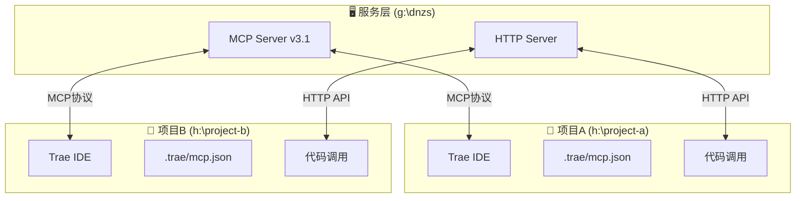

# 🖥️ 本地开发设置指南（无需全局安装）

如果你的网络环境无法安装 `skia-canvas`，或者你想在多个项目间共享同一个服务，使用本方案。

## 📋 方案概述

在同一台电脑上：
1. **在一个位置启动服务**（当前项目 `g:\dnzs`）
2. **其他项目通过 HTTP 或 MCP 连接到该服务**

无需全局安装 NPM 包！

---

## 🚀 快速开始

### 步骤 1：在当前项目启动服务

```bash
# 在 g:\dnzs 目录下
npm start
```

或指定端口：

```bash
node mcp-http-server.js
# 或
set MCP_PORT=3001 && node mcp-http-server.js
```

服务启动后会显示：
```
🚀 MCP HTTP服务已启动
═══════════════════════════════════════
📡 服务地址: http://localhost:3001
📋 健康检查: http://localhost:3001/health
🔧 工具列表: http://localhost:3001/tools
═══════════════════════════════════════
```

### 步骤 2：在其他项目中连接服务

#### 方式 A：通过 HTTP API 调用

```javascript
// 在其他项目的代码中
const axios = require('axios');

async function useLeaferService() {
  const baseURL = 'http://localhost:3001';
  
  // 检查服务是否运行
  const health = await axios.get(`${baseURL}/health`);
  console.log('服务状态:', health.data);
  
  // 获取工具列表
  const tools = await axios.get(`${baseURL}/tools`);
  console.log('可用工具:', tools.data);
}
```

#### 方式 B：在 Trae 中配置 MCP

在其他项目的 `.trae/mcp.json` 中：

```json
{
  "mcpServers": {
    "leafer-design-system": {
      "command": "node",
      "args": [
        "g:/dnzs/mcp-server-v3.js"
      ],
      "env": {
        "NODE_ENV": "production"
      },
      "description": "Leafer Design System MCP 服务（本地）"
    }
  }
}
```

**注意**：路径要使用你电脑上 `g:\dnzs` 的实际绝对路径。

#### 方式 C：使用 npx 直接连接（推荐）

在其他项目中不需要任何配置，直接使用：

```bash
# 检查服务是否运行
curl http://localhost:3001/health

# 使用 npx 调用（无需安装）
npx -y leafer-x-design-system@latest help
```

---

## 🔧 跨项目调用示例

### 项目结构示例

```
电脑
├── g:\dnzs                    # Leafer服务所在目录
│   ├── mcp-server-v3.js
│   ├── mcp-http-server.js
│   └── ...
│
├── h:\project-a               # 项目A（Trae开发）
│   └── .trae/mcp.json
│
└── h:\project-b               # 项目B（Trae开发）
    └── .trae/mcp.json
```

### 项目A的配置

**文件**: `h:\project-a\.trae\mcp.json`

```json
{
  "mcpServers": {
    "leafer-design-system": {
      "command": "node",
      "args": [
        "g:/dnzs/mcp-server-v3.js"
      ],
      "description": "Leafer Design System - 本地服务"
    }
  }
}
```

### 项目B的配置

**文件**: `h:\project-b\.trae\mcp.json`

```json
{
  "mcpServers": {
    "leafer-design-system": {
      "command": "node",
      "args": [
        "g:/dnzs/mcp-server-v3.js"
      ],
      "description": "Leafer Design System - 本地服务"
    }
  }
}
```

### 使用 HTTP API（不依赖 Trae）

```javascript
// 在任何项目的代码中
const axios = require('axios');

const LEAFER_SERVICE_URL = 'http://localhost:3001';

async function generateUI() {
  try {
    // 检查服务
    const health = await axios.get(`${LEAFER_SERVICE_URL}/health`);
    console.log('✅ 服务运行正常:', health.data.version);
    
    // 获取工具列表
    const tools = await axios.get(`${LEAFER_SERVICE_URL}/tools`);
    console.log('🔧 可用工具:', tools.data.tools.map(t => t.name).join(', '));
    
  } catch (error) {
    console.error('❌ 服务未启动，请先运行: npm start');
    console.error('   在 g:\\dnzs 目录下执行');
  }
}

generateUI();
```

---

## 📝 启动脚本

### Windows 批处理脚本

创建 `start-leafer-service.bat`：

```batch
@echo off
echo Starting Leafer Design System Service...
cd /d g:\dnzs
node mcp-http-server.js
pause
```

### PowerShell 脚本

创建 `start-leafer-service.ps1`：

```powershell
Write-Host "Starting Leafer Design System Service..." -ForegroundColor Green
Set-Location g:\dnzs
$env:MCP_PORT = 3001
node mcp-http-server.js
```

---

## 🔄 工作流程



---

## ✅ 检查清单

- [ ] 在 `g:\dnzs` 运行 `npm start` 启动服务
- [ ] 访问 `http://localhost:3001/health` 确认服务运行
- [ ] 在项目A创建 `.trae/mcp.json` 配置
- [ ] 在项目B创建 `.trae/mcp.json` 配置
- [ ] 在 Trae 中测试 MCP 工具调用

---

## 🐛 故障排除

### 问题 1：端口被占用

```bash
# 使用其他端口
set MCP_PORT=3002
node mcp-http-server.js
```

### 问题 2：路径错误

确保 `.trae/mcp.json` 中的路径是绝对路径：

```json
{
  "command": "node",
  "args": [
    "g:/dnzs/mcp-server-v3.js"
  ]
}
```

**注意**：Windows 路径可以用 `g:/dnzs` 或 `g:\\dnzs`

### 问题 3：服务未启动

```bash
# 检查服务是否运行
curl http://localhost:3001/health

# 如果没有响应，在 g:\dnzs 目录下启动
npm start
```

---

## 💡 提示

1. **服务只需要启动一次** - 可以在电脑开机时自动启动
2. **多个项目共享同一个服务** - 不需要重复安装
3. **Trae 会自动连接** - 配置好 `.trae/mcp.json` 后即可使用
4. **HTTP API 更灵活** - 不依赖 Trae，任何代码都可以调用

---

## 📚 相关文档

- [README.md](./README.md) - 项目说明
- [USAGE_GUIDE.md](./USAGE_GUIDE.md) - 详细使用指南
- [MCP_WORKFLOW.md](./MCP_WORKFLOW.md) - MCP工作流程
