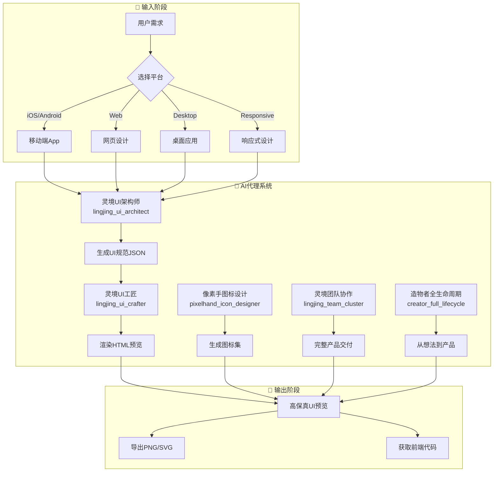
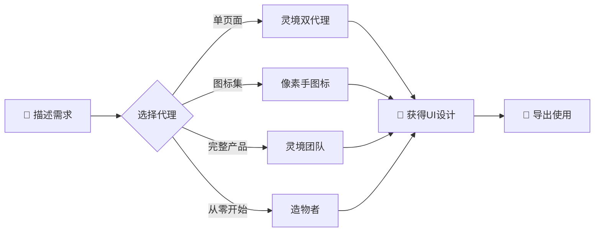
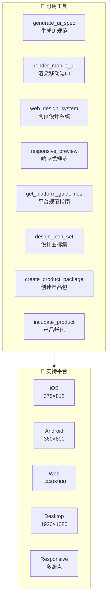
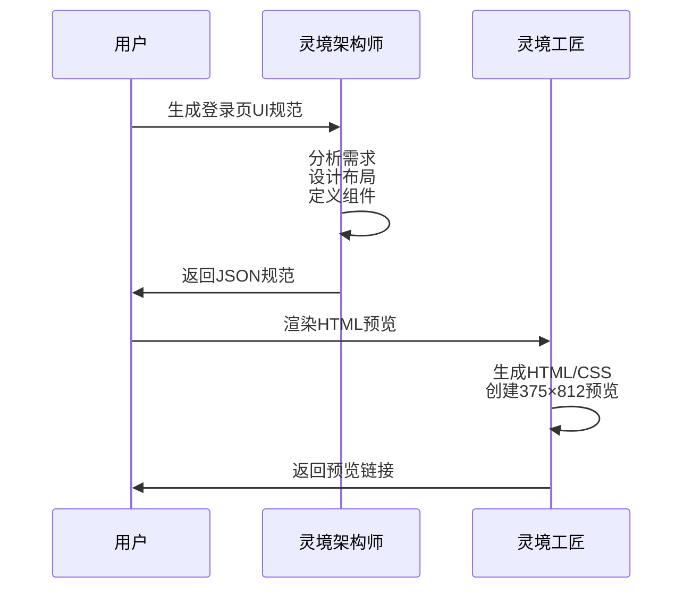
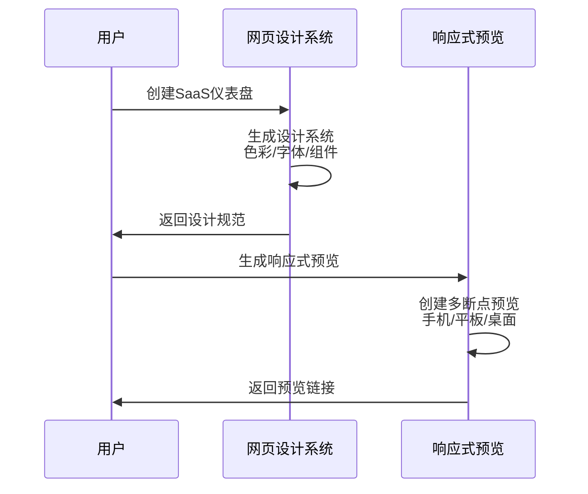
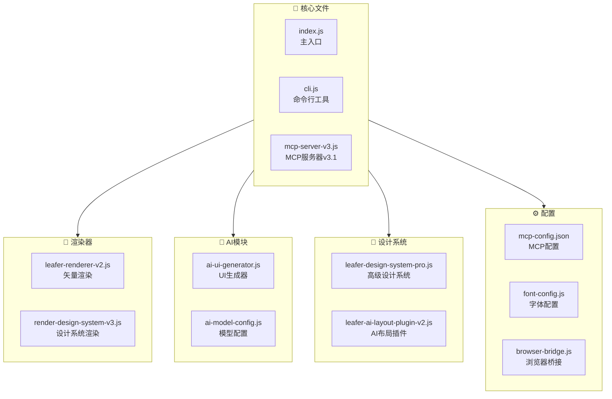

# 🎨 Leafer X Design System - 工作流程图

## 📊 完整工作流程



## 🔄 快速开始流程



## 🛠️ MCP工具速查



## 🎯 使用示例

### 示例1：移动端登录页


### 示例2：网页仪表盘


## 📁 项目结构



## 🚀 快速命令

```bash
# 启动MCP服务
npm start

# 生成设计系统
node cli.js generate "My App" "#667eea" "#764ba2"

# 渲染模板
node cli.js render ./templates/login.json
```

---

**支持的AI模型**: OpenRouter, DeepSeek, 通义千问, 字节豆包, Claude, GPT-4o 等16+模型

**输出格式**: PNG, SVG, HTML, JSON
